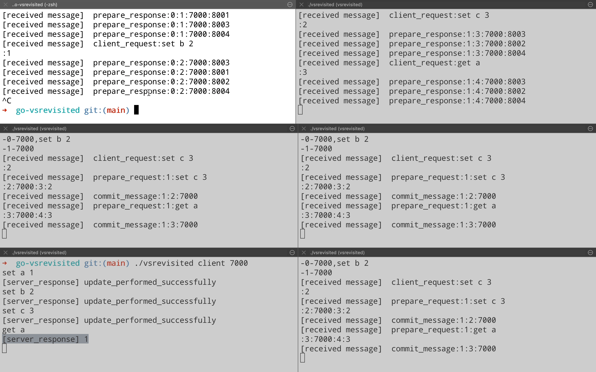

# go-vsrevisited
Golang implementation of [Viewstamped Replication revisited](https://pmg.csail.mit.edu/papers/vr-revisited.pdf) protocol

## How to run?
```
// Build the project
go build

// It's a 5 node cluster starting from port 8000 - 8004. So run the 5 server nodes
./vsrevisited server 8000
./vsrevisited server 8001
./vsrevisited server 8002
./vsrevisited server 8003
./vsrevisited server 8004

// Run the client on any port except 8000 - 8004
./vsrevisited client 7000
```

## Demo

#### Client operation with consensus across clusters(Node on port 8000 is leader)


#### First view change. (Node on port 8001 becomes leader)


#### Node recovery. (Node on port 8000 comes back up)


#### Second view change. (Node on port 8002 becomes leader)


## ToDo 
 - [ ] Add optimization for storing state on disk for faster recovery
 - [ ] Implement the reconfiguration protocol
